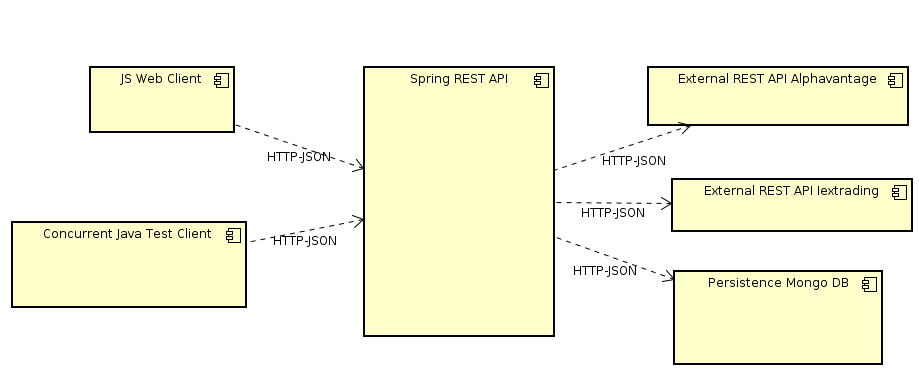

### Escuela Colombiana de Ingeniería
### Arquitecturas de Software - ARSW
### Laboratorio - 7 Bases de DAtos No-SQL Mongo DB.

#### Sergio Andres Rodriguez Torres

## Descripción de la arquitectura

Consta de un cliente pesado en JavaScript el cual genera de forma dinamica una tabla en la que se muestran los datos de la bolsa asociados a la compañia indicada, se hace uso de restAPIs externos que de forma asincrona entregan en mensajes JSON los datos de la bolsa (Alphavantage, Iextrading), la aplicación cuenta con persistencia de las consultas, de forma que una consulta solo la hace una vez al restAPI externo, la persistencia la lleva una base de datos no-SQL Mongo BD.
El proyecto esta montado sobre Spring boot el cual provee servicios de restAPI en /series

## [link Heroku](https://lab7-arsw.herokuapp.com/)